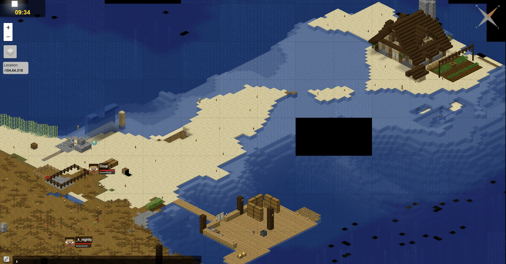
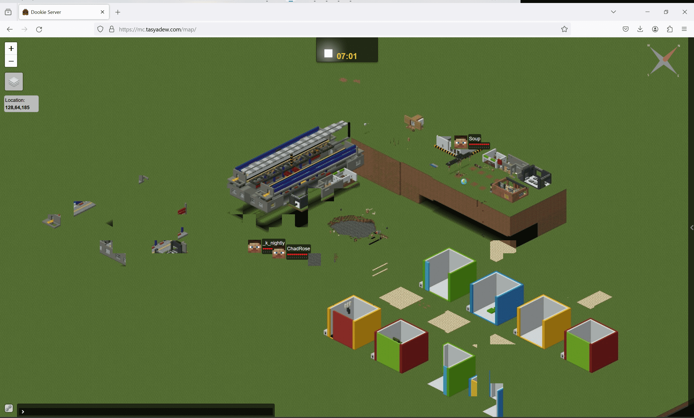

## Go to the sites

mc.tasyadew.com

- Accessing the link from website will take you to the Minecraft website. (port 80)
- Accessing the link from Minecraft will allow you to enter the Minecraft server. (port 25565)

## Tech Stack

- [Astro](https://astro.build/) for web development
- [Oracle Cloud](https://www.oracle.com/my/cloud/) for hosting minecraft server on the cloud
  - Operating System: [Ubuntu Linux](https://ubuntu.com/)
- [Nginx](https://docs.nginx.com/) for reverse proxy
- [Cloudflare](https://www.cloudflare.com/) for DNS record management
- [Docker](https://www.docker.com/) for containerization of Minecraft server

## Why I started this project?

This [Minecraft server](https://mc.tasyadew.com) project was started to help my friend, who initially hosted a Minecraft server on his PC. Our friends play the game at different times, requiring the server to be available 24/7. Initially, he used a free Minecraft hosting service called [Aternos](https://aternos.org/:en/), but with over 150+ mods installed, the server became extremely laggy and barely playable. He then self-hosted from his PC using free DDNS with [No-IP](https://www.noip.com/), which worked well until his PC broke down due to the constant need to be on 24/7.

After hearing about his issue, I suggested that we could collaborate and deploy a server on an Oracle VPS. Fortunately, I had an underutilized VPS that could host the Minecraft server 24/7. Initially, I thought it would be a simple two-week project to set up the server and ensure all mods that require special ports were functioning. However, the project grew larger in scope than just deploying a game to a VPS. Here are a few notable features I have implemented:

- Setting up a firewall to open ports using [firewallcmd](https://firewalld.org/documentation/man-pages/firewall-cmd.html) instead of UFW, since Oracle VPS does not support UFW (a lesson learned the hard way).
- Creating an official website for the game on the VPS, including a Minecraft map, a development blog, and a guide on how to join the server. (still in progress)
- Using NGINX to reverse proxy ports for two Minecraft servers, and the Minecraft website.
- Applying for an SSL certificate using Let's Encrypt and Certbot.
- Developing an autobackup system for both Minecraft servers using Docker. (still in progress)

In the future, I hope to write a comprehensive guide on how to set up a Minecraft server from start to finish, for anyone interested in recreating this project.

## Map Preview of the server

Can be accessed from [map.tasyadew.com](https://map.tasyadew.com) or [mc.tasyadew.com/map](https://mc.tasyadew.com/map)

Latest Map Server:

Old Map Server:

