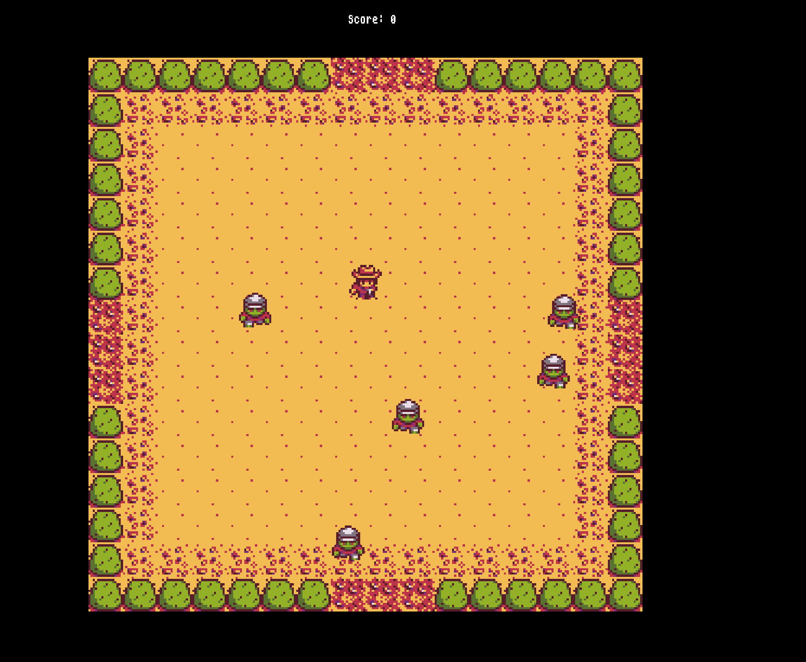
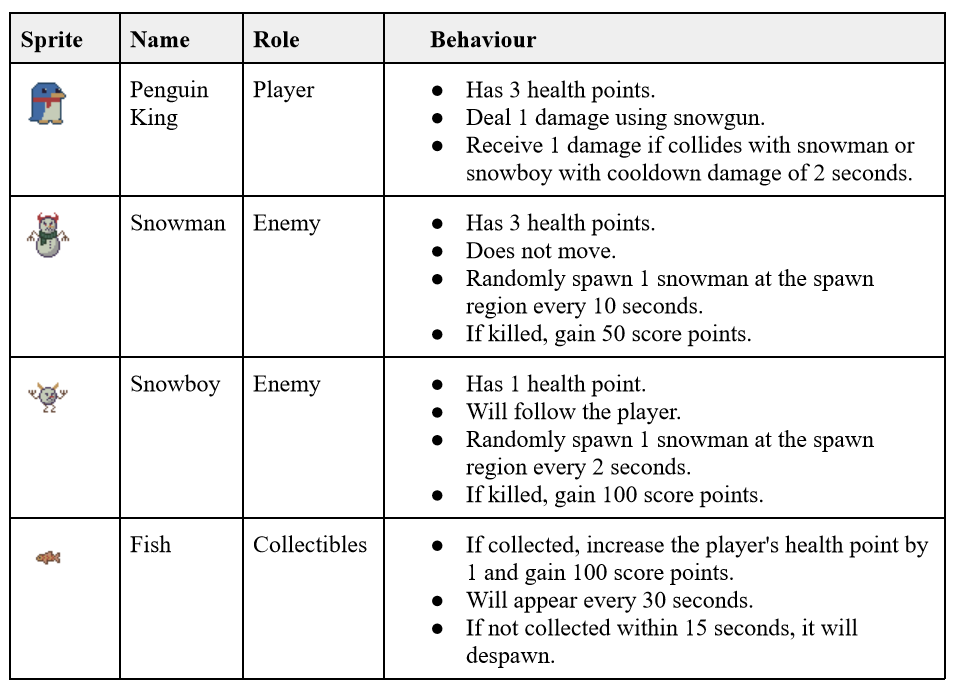

## Play the game

Available on itch.io: [Journey of Penguin King](https://tasyadew.itch.io/journey-of-the-penguin-king)

You can play the game from any web browser on [itch.io](https://itch.io/). It's compatible with both mobile and desktop devices and doesn't require you to create an account to play.

## Game inspiration

My game idea is inspired by a mini-arcade game available in **Stardew Valley**, called "*Journey of the Prairie King*".

The game mechanics are simple: it's a top-down shooter game. There are multiple waves, and you need to survive within the given timer to advance to the next wave. Collectibles and power-ups can help you defeat the enemies.

## What my game is about?

In this game, you are the great Penguin King that has been captured and need to survive by shooting the evil snowman and snowboy!! Can you survive for 150 seconds?

## Game Controls

For Desktop:

- Use WASD to move.
- Use the right joystick to aim and shoot.

For Mobile:

- Use the left joystick to move.
- Use the right joystick to aim and shoot.

## The Characters

