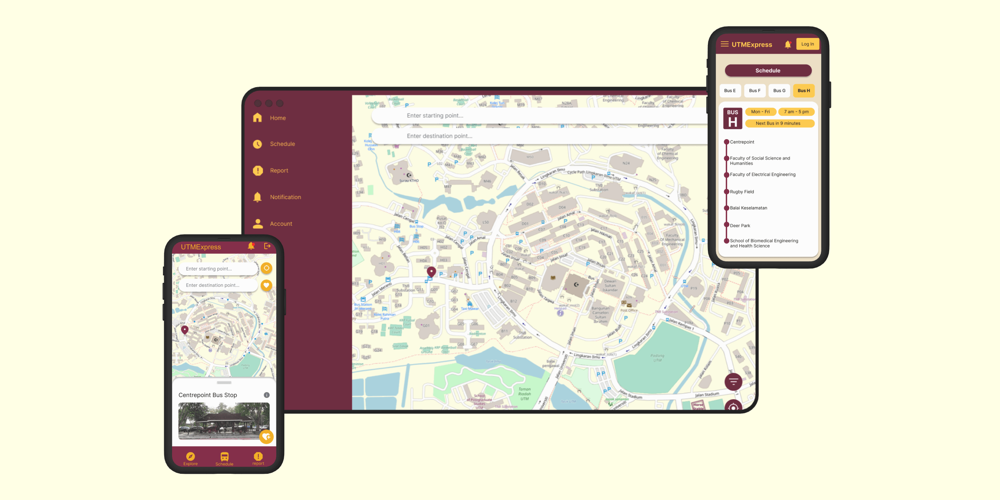
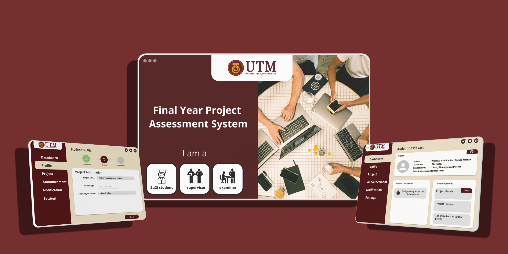
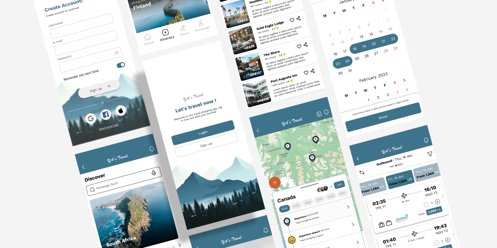
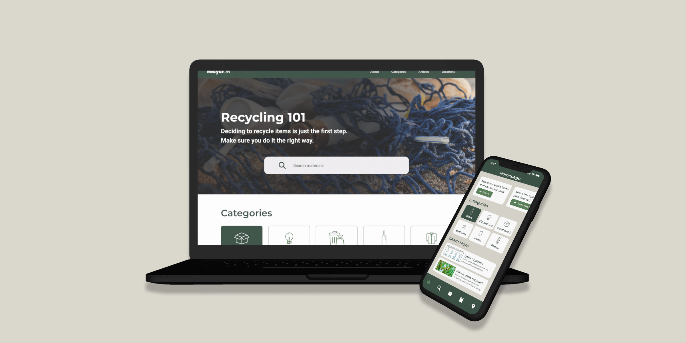
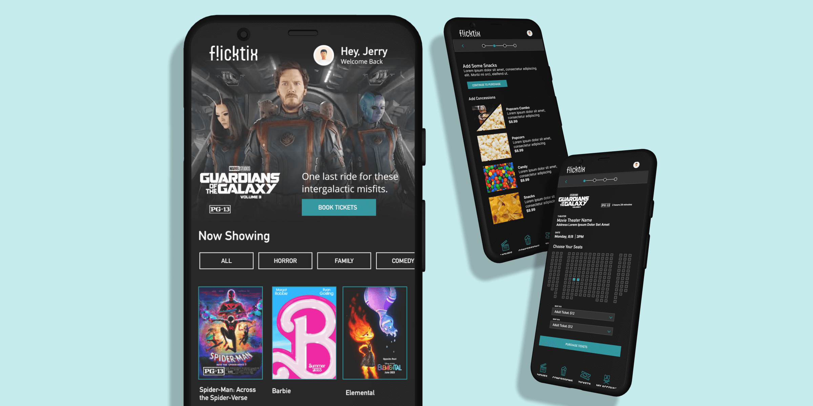

Here are several web, mobile, and desktop application designs I’ve created as part of my UI/UX design studies, primarily developed using Figma. These projects showcase my exploration and application of design principles to create intuitive and visually appealing user experiences across multiple platforms.

## University Projects

### UTM Express

UTMExpress is a mobile application designed to track the real-time location of buses, display bus schedules, show routes based on bus types, and provide estimated arrival times, offering users a convenient and efficient way to plan their commutes.

- Figma: [Figma Link](https://www.figma.com/design/F2gdpKDFFcbiEQUzHDiOJ2/FYP-Assessment-System?node-id=0-1&t=9u7qZZNfa2UAMJRz-1)

### UTM FYP Assessment

UTM FYP Assessment is a web application that facilitates the tracking of final year project progress among students, supervisors and examiners, ensuring students stay informed about deadlines and can easily submit updates to their supervisors. It streamlines communication and project management for all parties involved.

- Figma: [Figma Link](https://www.figma.com/design/c9kHUSDZJbEMbE5jM5DR2I/UTMEXxpress?node-id=0-1&t=SnBEgrHh6QViU9th-1)

---

## Google Course Projects

This work is develop to complete the [Google UX Design Certificate](https://grow.google/certificates/ux-design/)



### YA's Travel

YA's Travel Agency is a global travel agency located in Taipei, Taiwan that provides global travel services. YA's travel agency targets adults who are short on time or unsure of how to prepare their travel itinerary and creates customized itineraries for them.

- Figma: [Figma Link](https://www.figma.com/design/73zhRAOP9wG2OrCA0dg0CC/YA's-Travel?node-id=2-18599&t=ie8U0bz5EO4IJS0o-1)
- Slides: [Presentation Slides Link](https://drive.google.com/file/d/18s0985PC2NT9rPwWg07C2od0HrU2DLG9/view?usp=sharing)

### Recyclon

Recyclon helps users to find information regarding different items they want to recycle, details on what can be recycled and what is the best way to do it.

- Figma: [Figma Link](https://www.figma.com/design/Lpr6uhWUD29h9nN6wvQs7n/RecyclON?node-id=2-3&t=NutBotdr2psL2J9z-1)
- Slides: [Presentation Slides Link](https://drive.google.com/file/d/145aiw5ejgziZEA8H3Eo4sKzbqXPunm7n/view?usp=sharing)

### FlickTix

FlickTix is a movie ticketing app to bring in both new and frequent movie-goers and give them an inviting and accessible platform to book tickets.

- Figma: [Figma Link](https://www.figma.com/design/kaCYAiSLyDpIwtwjoVQMJX/FlickTix?node-id=1-2&t=ZpqkX1rKOvP2H7SJ-1)
- Slides: [Presentation Slides Link](https://drive.google.com/file/d/1OCMBI3TtnjraK_vL80jbtE27Djg4kz92/view?usp=sharing)
